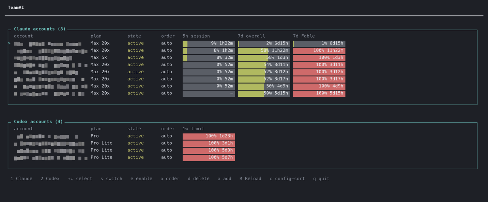

# TeamAI

[English](README.md) · [한국어](README.ko.md) · **日本語** · [中文](README.zh-CN.md) · [Español](README.es.md)

TeamAI は **Claude Code** と公式 **Codex CLI** のためのローカル多アカウントリレーです。プロバイダーごとに独立したアカウントプールを保持し、選ばれたサブスクリプションが利用できない、またはクォータを使い切っている場合は別のアカウントでリクエストを再試行します。



<sub>上のダッシュボードは <code>teamai capture --redact full</code> で作った実際のキャプチャです。実際のクォータとアクティビティログで、アカウントのアドレスは含まれていません。</sub>

> TeamAI は独立したオープンソースプロジェクトです。Anthropic、OpenAI、および無関係なサービスである teamai.com とは一切関係ありません。

## 必要環境

- Node.js 20 以上
- macOS または Linux
- `claude` および／または `codex` を別途インストール済みであること
- ご自身の Claude Pro/Max または ChatGPT Codex のサブスクリプションアカウント

## インストール

```bash
git clone https://github.com/soulduse/team-ai.git
cd team-ai
./scripts/install.sh
```

`install.sh` は依存関係のインストール、ビルド、`teamai`/`tai`/`tac`/`tax` コマンドのリンクを行い、シェルブロックを追加するかどうかを尋ねます。冪等なので、アップグレードする際は再実行するだけで済みます。シェルブロックを省略するには `--no-shell`、実際には変更せず何が行われるかを確認するには `--dry-run` を渡してください。

手動で同じことを行う場合:

```bash
npm install
npm run build          # 必須: dist/ はコミットされていません
npm link
```

AI エージェントからこれを自動化しますか？ [AGENTS.md](AGENTS.md) に、同じ手順が検証と失敗時の分岐を備えた決定的なコマンドとしてまとめられています。

## クイックスタート

```bash
teamai login
tai
```

`login` は `[1] Claude` と `[2] Codex` のどちらを追加するかを尋ねます。アカウントを追加するには繰り返し実行してください。`tai` は短いセッションコマンドで、`teamai start` と同等です。ローカルリレーを起動してダッシュボードを開きます。TUI で `1` を押すと Claude Code が、`2` を押すと Codex が起動します。クライアントを終了するとダッシュボードに戻ります。

特定のプロバイダーで直接セッションを開始するには、専用のランチャーを使います。必要に応じて TeamAI リレーを自動的に起動し、後続の引数はすべて公式クライアントにそのまま渡します。

```bash
tac                   # TeamAI のアカウントプール経由の Claude Code
tac --resume          # teamai claude --resume と同じ
tax                   # TeamAI のアカウントプール経由の Codex
tax resume            # teamai codex resume と同じ
teamai claude         # tac の長い形式
teamai codex          # tax の長い形式
teamai session        # [1] Claude か [2] Codex を対話的に選択
```

これらの名前は、既存の TeamClaude の `tc` シェル関数を置き換えないよう意図的に選ばれています。`tc` は引き続き TeamClaude を、`tac` と `tax` は TeamAI を対象にできます。

## シェル設定

```bash
./scripts/install-shell.sh            # ~/.zshrc にマーカー付きのブロックを追加
./scripts/install-shell.sh --dry-run  # 差分を表示するだけで、書き込みは行わない
./scripts/install-shell.sh --uninstall
```

プールを経由する `cl`（Claude Code）と `co`（Codex）、さらに `tai`、`tais`、LaunchAgent 用の `taistart`/`tairestart`/`taistop` を定義し、グローバルに固定された `ANTHROPIC_BASE_URL` を解除します。TeamAI はセッションごとに独自のポートを指すため、古いグローバル値が残っていると、すでに動いていないかもしれないプロキシへトラフィックを送るだけになるからです。このブロックはマーカーで区切られ、その場で書き換えられるので、再実行しても追記されるのではなく更新されます。書き込みのたびにタイムスタンプ付きのバックアップが残り、インストールとアンインストールを繰り返してもファイルはバイト単位で復元されます。

スーパーバイザーは任意です。`cl`、`co`、`tai`、`teamai run` はいずれも、何もリッスンしていなければ自分でリレーを起動するため、LaunchAgent がアンロードされていても、失敗していても、そもそもインストールされていなくても動作し続けます。強制終了されたプロセスが残した古い `server.json` は無視されて置き換えられます。起動に失敗した場合は、素っ気ない「did not start」ではなく、サーバーから返された理由（ポートがすでに使用中、資格情報ファイルが読み取れない、など）が報告され、完全な出力は `~/.config/teamai/server-start.log` に保存されます。

### リレーをログイン項目として実行する

これは任意です。上でインストールされる `taistart`/`tairestart`/`taistop` エイリアスは `com.teamai.proxy` というラベルの LaunchAgent を操作するため、このラベルを正確にそのまま使ってください。

```xml
<!-- ~/Library/LaunchAgents/com.teamai.proxy.plist -->
<?xml version="1.0" encoding="UTF-8"?>
<!DOCTYPE plist PUBLIC "-//Apple//DTD PLIST 1.0//EN" "http://www.apple.com/DTDs/PropertyList-1.0.dtd">
<plist version="1.0">
<dict>
  <key>Label</key>          <string>com.teamai.proxy</string>
  <key>ProgramArguments</key>
  <array>
    <string>/usr/local/bin/node</string>
    <string>/ABSOLUTE/PATH/TO/team-ai/dist/src/cli.js</string>
    <string>server</string>
  </array>
  <key>RunAtLoad</key>      <true/>
  <key>KeepAlive</key>      <true/>
  <key>StandardErrorPath</key> <string>/tmp/teamai.err.log</string>
</dict>
</plist>
```

```bash
launchctl bootstrap gui/$(id -u) ~/Library/LaunchAgents/com.teamai.proxy.plist
```

Node の実際のパスは `command -v node` で確認したものを使ってください。LaunchAgent はシェルの PATH を引き継ぎません。

## アカウント

Codex は通常のブラウザログインフローをそのまま使います。TeamAI は、ChatGPT の任意設定であるデバイスコード認証を有効にしておくことを要求しません。

資格情報のインポートは任意で、エクスポート可能な資格情報ファイルが存在する場合にのみ動作します。

```bash
# 既存の TeamClaude 設定からすべてのアカウントをインポートする
teamai import claude --from ~/.config/teamclaude.json

# Codex CLI の現在のファイルベースのログインをインポートする（存在する場合）
teamai import codex
```

最近のバージョンの Claude Code は、資格情報を `~/.claude/.credentials.json` ではなく macOS キーチェーンに保存することがあります。その場合は `teamai login` を使ってください。`import` は元の TeamClaude、Claude Code、Codex のファイルを一切変更しません。TeamAI はリレーされるセッション用に隔離された永続的な Codex ホームを使うため、ユーザー本来の `~/.codex` はそのまま残ります。

## 運用

```bash
teamai status                                  # サーバー状態 + アカウント表
teamai accounts [claude|codex]                 # アカウント表のみ
teamai start                                   # リレーを起動し、ダッシュボードを開く
teamai stop                                    # リレーを停止
teamai restart                                 # 停止、起動、ダッシュボードを開く
teamai server                                  # リレーをフォアグラウンドで実行
teamai tui                                     # ダッシュボードのみ、自動起動なし
teamai disable codex user@example.com
teamai enable codex user@example.com
teamai priority claude user@example.com 1      # または: auto
teamai capture [--redact partial|full|none] [--out DIR]   # ダッシュボードを .txt と .png に保存（TTY 不要）
```

アカウントはクォータの残りが多い順、つまり消費が少ない順に並びます。これはダッシュボードでもプール自身の選択でも同じなので、一番上の行が次のリクエストの送り先になるアカウントです。Claude は全体の週次ウィンドウではなくモデル別週次（Fable）ウィンドウで判定します。最上位モデルを最初に拒否するのが実際にはそのウィンドウだからです。すべてのアカウントを使い切ると全員が同点になり、順序は最も早く空くものが先という基準に引き継がれます。今日どのアカウントもリクエストを処理できない状況では、リセットまでの時間だけが区別する唯一の手がかりになります（Claude は Fable ウィンドウ、Codex は週次ウィンドウを基準とします）。未計測のアカウントは最後に並び（不明は空であることと同じではありません）、ピン留めされた優先度は依然として優先され、`c` で設定された順序に戻せます。

**モデル対応ルーティング.** モデル別週次ウィンドウを消費するのは最上位モデル（Claude の Fable ティア）だけなので、それを必要としないリクエスト（Opus、Sonnet、Haiku）は、まだ Fable の残量があるアカウントを避け、Fable ウィンドウをすでに使い切った（`fableReserveThreshold` 以上の）アカウントへ振り分けられ、そのグループ内では全体の週次ウィンドウの残量順に並べられます。こうすることで、各アカウントの希少な Fable の残量を本当にそれを必要とするリクエストのために取っておき、遊んでいる週次の余力を活かせます。使い切ったアカウントに空きがないときは、失敗させるのではなく、取っておいたアカウントにフォールバックします。Fable リクエストは通常どおり消費の少ない順を保ちます。`fableReserveThreshold` を `1` にするとこの振り分けを無効化できます。

Fable ティアの 429（共有の `5h`/`7d` ウィンドウはまだ許可されている一方で `7d_oi` が拒否された場合）は、アカウント全体ではなくそのアカウントの Fable ウィンドウだけをベンチに下げます。最上位モデルしか消費しない予算のためにアカウント全体が最大 1 週間眠ってしまうのではなく、他のすべてのモデルは引き続きそのアカウントから提供されます。共有ウィンドウを拒否する 429 は、これまでどおりアカウントをベンチに下げます。

フルスクリーンの TUI は Claude と Codex のアカウントをグループ分けし、使用量が変化しても現在選択中のアカウントを固定したままにします。Claude の行は `5h session`、`7d overall`、そしてモデル単位の `7d Fable` の各ウィンドウを個別に表示します。Codex の行は主・副のウィンドウを表示し、それぞれにそのアカウントが実際に報告した期間（`1w limit`）を見出しとして付けます。クォータは公式クライアントの応答から学習され、再起動後も保持されます。

フッターは TeamClaude と同じアカウントワークフローを提供します。Claude/Codex の起動、選択、切り替え、有効化／無効化、並び替え、削除、追加／ログイン、再計測（`R`）、終了です。`switch` は選択したアカウントをそのプロバイダーのプールの先頭にピン留めします。並び替えモードでは順位を割り当てたり、アカウントを自動スケジューリングに戻したりできます。Claude のプロフィールを更新すると、プランのティアと `past_due` のような不健全なサブスクリプション状態が赤色で表示されます。

`p` はダッシュボードをキャプチャして保存し、`teamai capture` は端末なしでスクリプトやエージェントから同じことを行います。キャプチャは `~/.config/teamai/captures/`（または `--out DIR`）配下にファイル一組として残ります。色をそのまま保ったテキストのフレームと、内蔵のビットマップフォントで描いた同じフレームの PNG で、Node 以外に必要なものはありません。アカウントのアドレスはフレームを描く前にマスクされるため、アカウント列・フッター・アクティビティログのどこにも残りません。既定は `de•••••••••w@gm•••.com` 形式の部分マスクで、`--redact full` は `account #N` に置き換え、`--redact none` は自分だけで見るキャプチャのためにアドレスをそのまま残します。ダッシュボードで `p` を押すと、保存に加えてファイルマネージャーでその PNG を選択した状態で開き、画像をクリップボードにコピーします。macOS ではそのまま動作し、Linux では `xdg-open` と `wl-copy` または `xclip` があれば動作します。実際にどれが行われたかはフッターに表示されます。この README 冒頭の画像もそのようにして作ったキャプチャです。

`R` はすべてのアカウントのクォータを再計測します。クォータは専用のエンドポイントをポーリングして取得するものではなく、アップストリームが返す rate-limit ヘッダーから学習されます。そのため、まだ一度もトラフィックを処理していないアカウントは、何かが計測するまで `-` と表示されます。`R` は受理されることが分かっているリクエスト形式を、アイドル状態のすべてのアカウントに対して並列で再送し（すでに計測済みのアカウントやスロットルされているアカウントも含みます。それらの 429 応答にも信頼できるヘッダーが含まれているためです）、`measured/targets` を正直に報告します。このリクエスト形式は、実際にプロキシを通過した 2xx 応答からのみ確定されるため、リクエストが一度も成功していないうちは、`R` はペイロードを推測するのではなく、まだプローブのテンプレートが存在しないと報告します。モデル単位の週次（Fable）ウィンドウが欠けているアカウントには、追加の補充プローブを 1 回だけ送ります。このウィンドウは Fable ティアのリクエストへの応答にしか現れないからです。

サーバーは 5 分ごとに自律的なウォームアップも行います（`warmupIntervalMs`、`0` で無効化）。アップストリーム側ですでにリセットされたクォータウィンドウを消去し、未計測のアカウントだけを計測するため、落ち着いた状態の構成では 1 ティアあたりのコストがかからず、ウィンドウが切り替われば誰も `R` を押さなくても補充されます。アップストリームがクォータを一向に報告しないアカウントは、3 回無駄な試行をした時点で対象から外され、その予算はウィンドウがリセットされるか `R` を押したときに再び与えられます。

アイドル状態のアカウントも同じ 5 分周期で生かし続けます。トークンの有効期限が近い、または前回の試行がエラーになったアカウントは、1 つずつ順番にリフレッシュされます。通常のトラフィックは一部のアカウントに偏り、ウォームアップはあえてトークンをリフレッシュしないため、これがないと誰も使っていないアカウントはリフレッシュトークンのチェーンが途切れ、アップストリームに無効化されてしまう恐れがあります。このスイープを逐次にしているのは意図的です。長いダウンタイムのあとに構成全体を一度にリフレッシュすると、トークンエンドポイントへのバーストがレート制限を招くからです。

学習したクォータ（使用量、ウィンドウ、リセット時刻、サブスクリプションのプロフィール）はディスクに書き込まれ、次回の起動時に復元されます。そのため、再起動しても再計測なしでダッシュボードと並び順が維持されます。`R` が再送するプローブ形式も同じように永続化されます。応答ごとのシグナルはそうではありません。クールダウンやエラーは再起動時にあえて破棄されるので、古い 429 の retry-after によってアカウントが再びベンチに下げられることはありません。本当に使い切っているなら、次のリクエストで正しい状態が改めて導き出されます。

構成全体のアカウントごとの同時実行数の合計で処理できる以上のリクエストが一度に届いた場合、リレーはリクエストボディを読み込む前に、あふれた分を `429`（`x-teamai-429-reason: concurrency_saturated`）で拒否します。ボディを無制限にバッファリングすることはありません。この同じヘッダーは、「利用可能なアカウントがない」ときの 429 において、混雑している構成と使い切った構成（`quota_exhausted`）を区別します。

`~D-N` というサブスクリプションの値は推定値であり、確定した有効期限ではありません。Anthropic のプロフィールエンドポイントはサブスクリプションの状態と作成時刻を公開していますが、現在の請求期間の終了日は公開していません。そのため TeamAI は次の月次請求応当日を推定し、`~` を付けて示します。プロフィールの状態はサーバー起動時と、その後 6 時間ごとに更新されます。

## 設定

設定と資格情報は `$TEAMAI_HOME` に置かれ、なければ `$XDG_CONFIG_HOME/teamai`、次に `~/.config/teamai` の順にフォールバックします。プロキシは `127.0.0.1` にバインドし、生成されたローカルクライアントトークンを要求します。

`config.json` は初回実行時に次の既定値で作成されます。

| キー | 既定値 | 意味 |
| --- | --- | --- |
| `proxy.host` | `127.0.0.1` | バインドアドレス。設計上ループバック専用です。 |
| `proxy.claudePort` | `3456` | Claude リレーのポート。 |
| `proxy.codexPort` | `3457` | Codex リレーのポート。 |
| `proxy.controlPort` | `3556` | TUI が通信する制御チャネル。 |
| `proxy.clientToken` | 自動生成 | リレーされるすべてのクライアントが送る必要のあるローカルトークン。 |
| `switchThreshold` | `0.98` | この使用率を超えたアカウントは選択されなくなります。 |
| `warmupIntervalMs` | `300000` | バックグラウンド再計測の間隔。`0` で無効化。 |
| `maxConcurrentPerAccount` | `3` | 1 アカウントあたりに許可される同時実行リクエスト数。 |
| `fableReserveThreshold` | `0.8` | この値以上に Fable ウィンドウを消費したアカウントを非 Fable リクエストに優先します。`1` でモデル対応ルーティングを無効化。 |
| `proxy.legacyPorts` | — | 任意。プロバイダーごとに応答を継続する追加ポート。例: `{ "claude": [3400] }`。 |

他のプロセスがすでにポートを占有している場合は変更してください。起動失敗のよくある原因であり、その理由は `server-start.log` に記録されます。

クライアントは起動時にベース URL を渡され、あとから向き先を変えることはできません。そのため `config.json` でポートを変更すると、そのままでは、すでに開いているセッションがすべて接続拒否で取り残されてしまいます。そこでリレーは、組み込みの既定ポートと、`proxy.legacyPorts` に列挙したポートでも応答し続け、ポート変更をまたいで開いているセッションを生かし続けます。他のものがすでに占有しているレガシーポートは、メインのポートに影響を与えることなくスキップされ、起動後のソケットエラーはリレーを落とさずにログに記録されます。

## 適用範囲とコンプライアンス

バージョン 0.1 は、サブスクリプションの OAuth アカウントと、ラッパー経由で起動される CLI セッションを対象としています。公開の OpenAI 互換 API は提供せず、Claude のリクエストを Codex のリクエストに変換することも、Codex Desktop をサポートすることも、異なる人物の資格情報をプールすることもありません。プロバイダーの規約とポリシーを遵守する責任は利用者にあります。本番用・商用の API ワークロードには、各プロバイダーの公式な API 課金の仕組みを使ってください。

## 開発

```bash
npm run typecheck
npm test
npm run lint
```

派生物については [NOTICE](NOTICE) を、ローカルのセキュリティモデルについては [SECURITY.md](SECURITY.md) を参照してください。
